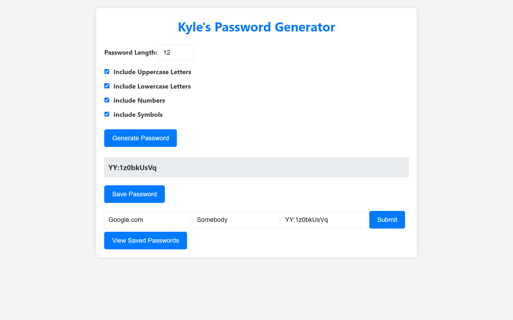

# Password Manager

## Description:
This Is A Web-Based Password Manager Application That Allows Users To Generate, Save, View, And Delete Passwords Securely. The App Encrypts Stored Passwords, Ensuring That Only An Admin Can View The Saved Passwords

## Features:
- **User-Generated Admin Password:** Create An Admin Password Of Your Choice During The Initital Setup That Is Encrypted And Stored Securely In The Database
- **Rate Limits:** Prevent Brute-Force Attacks By Limiting The Number Of Admin Password Login Requests In A Set Interval (Default 5 Attempts Within A 5 Minute Window, Configurable)
- **Generate Strong Passwords**: Create Random Passwords With Customisable Length And Character Types (Uppercase, Lowercase, Numbers, Symbols)
- **Save Passwords**: Save Generated Passwords Along With Website And Username Information
- **View Passwords**: Admins Can View Saved Passwords After Entering The Admin Password
- **Delete Passwords**: Remove Saved Passwords From The Database

## Tech Stack:

- **Frontend**: HTML, CSS, JavaScript
- **Backend**: Node.js, Express.js
- **Database**: MongoDB
- **Encryption**: crypto-js


## Installation:

Clone The Repository:
```bash
git clone https://github.com/Kyle8973/password-manager
cd password-manager
```

Install Dependencies:
```bash
npm install
```

Create A .env File And Add The Following:
```bash
PORT=3000 # Port The Server Will Run On
MONGODB_URL= # MongoDB URL
RATE_LIMIT_WINDOW_MINUTES=5 # Rate Limit Window In Minutes
RATE_LIMIT_MAX_REQUESTS=5 # Maximum Number Of Requests Allowed In The Rate Limit Window
```

Run The Server Setup:
```bash
node setup.js
```

Start The Server:
```bash
npm start
```

## Usage:

**Generating Passwords:**
- Set The Desired Password Length
- Select The Types Of Characters You Want To Include: Uppercase, Lowercase, Numbers, And / Or Symbols
- Click The "Generate" Button To Create A New Password

**Saving Passwords:**
- After Generating A Password, Click "Save Password"
- Fill Out The Website And Username Fields, Then Click "Submit"

**Viewing Saved Passwords:**
- Click "View Saved Passwords" Button
- Enter The Admin Password
- Click The "View Passwords" Button
- A List Of Saved Passwords Will Be Displayed
- Use The "Reveal" Button To Show A Password, Or The "Delete" Button To Remove It

## Screenshots:





## FAQs:
#### How Do I Set An Admin Password?
Run `node setup.js`

#### How Do I Start The Server?
Run `npm start`

#### How Do I Reset My Admin Password?
If You Have Already Set An Admin Password And Wish To Reset It, Run `node setup.js` And Follow The Instructions In The Console

## License:
This Project Is Licensed Under The MIT License - See The [LICENSE](LICENSE) File For Details

## Changelog:
See The [Change Log](CHANGELOG.md) File For Details

## Authors:

- [Kyle8973](https://www.github.com/kyle8973)
